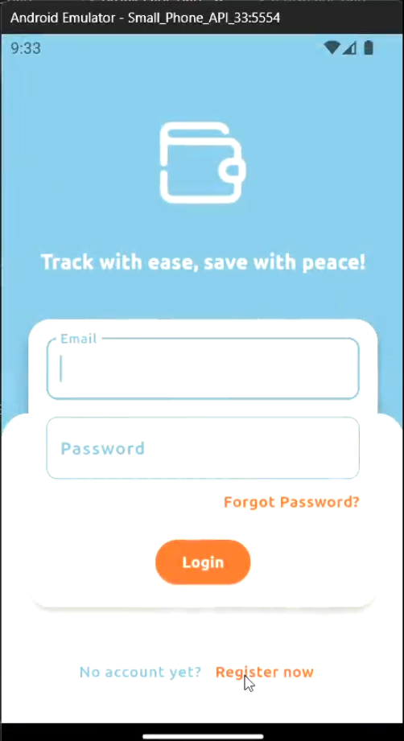

# Expense Tracker Flutter App

A personal finance tracking application built with Flutter and Firebase. The app allows users to register, log in, record income and expenses, view transaction history, and manage their profile.

## Overview
This project is a mobile application for tracking personal income and expenses. It provides user authentication, transaction recording, balance calculation, monthly history viewing, and profile management. The app was developed with Flutter and uses Firebase services for authentication and cloud data storage.

## Features
- User registration and login
- Password reset via email
- Add income and expense transactions
- Select transaction date
- View current balance, total income, and total expense
- View recent transactions
- View transaction history grouped by month
- Delete transaction history items
- View and edit user profile
- Logout functionality

## Tech Stack
- Flutter
- Dart
- Firebase Authentication
- Cloud Firestore

## Demo Video

[](https://github.com/user-attachments/assets/b7f4799b-0606-4096-9325-33788ba05d0b)

## Project Structure
- `lib/` : main application source code
- `assets/` : images and local assets
- `test/` : test files
- `android/`, `ios/`, `web/`, `windows/`, `linux/`, `macos/` : platform support files

## Key Screens
- Login page
- Register page
- Forgot password page
- Home / transaction summary page
- History page
- Profile page

## My Role
- Designed and developed the Flutter application
- Implemented authentication flow with Firebase Authentication
- Integrated Cloud Firestore for storing user and transaction data
- Built transaction summary and monthly history features
- Developed profile management and account-related screens

## Firebase Setup
This project requires Firebase configuration to run properly.  
If Firebase config files are not included in this repository, create your own Firebase project and add the required configuration files for each platform.

## How to Run
1. Install Flutter SDK
2. Run:
   ```bash
   flutter pub get
   ````

3. Configure Firebase for the project
4. Start the app:

   ```bash
   flutter run
   ```

## Notes

This repository is intended for portfolio and educational showcase purposes.

## Project Status

Academic Project                                                                                         
Mobile Application Course                                                       
Kasetsart University Sriracha Campus
